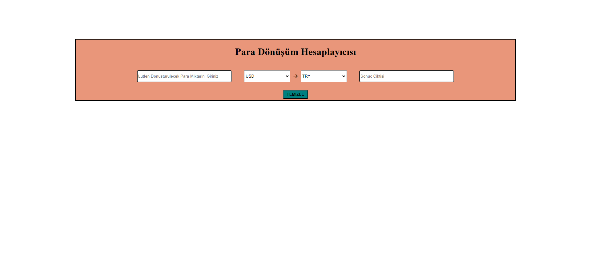
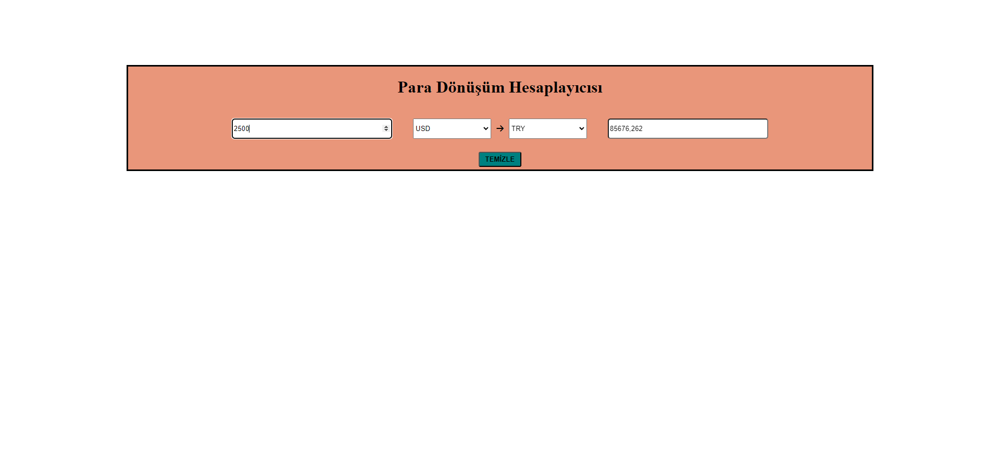
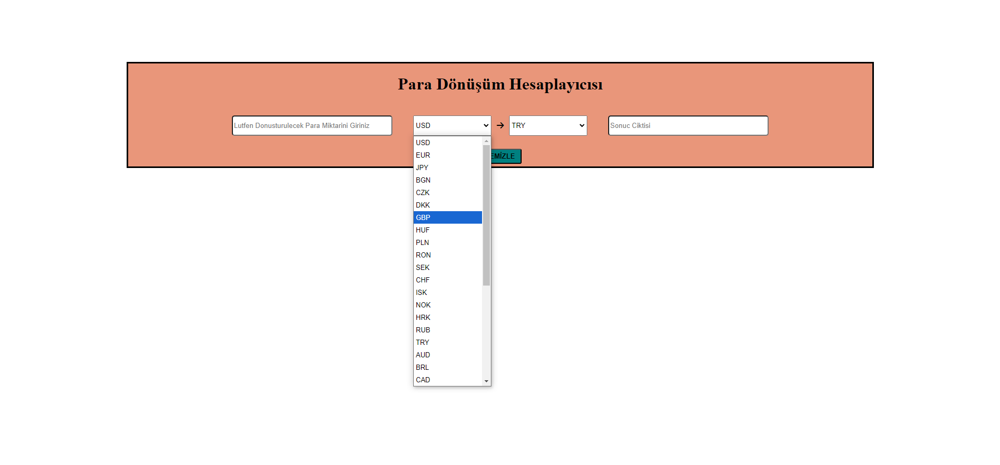
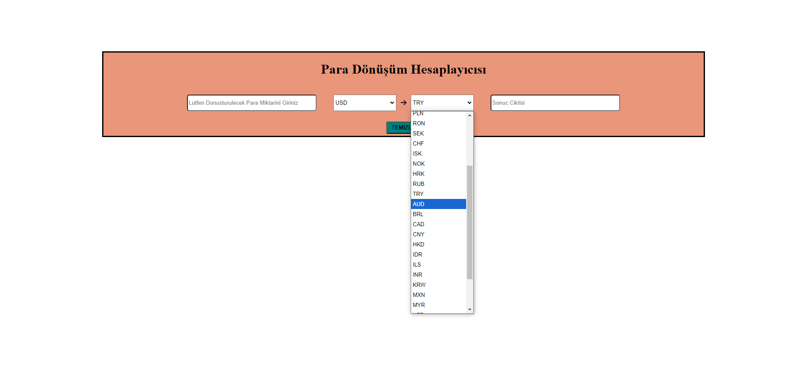

# Currency-Converter-App
Yapmis olduğum uygulama, çeşitli para birimleri arasında hızlı ve kolay dönüşüm yapmanıza yardımcı olur. Kullanıcılar, istedikleri bir miktarı seçilen bir para biriminden başka bir para birimine dönüştürebilir. Modern ve kullanıcı dostu arayüzü sayesinde, döviz kurlarını anında öğrenebilir ve işlemlerinizi gerçekleştirebilirsiniz.

## Kullanılan Teknolojiler
- **HTML**: Uygulamanın yapısal iskeleti için.
- **CSS**: Görsel tasarım ve stil için.
- **JavaScript**: Dinamik işlevsellik ve para dönüşüm hesaplamaları için.
- **API**: Gerçek zamanlı döviz kurları almak için.

## Kullanım
Bu Para Dönüşüm Hesaplayıcısı uygulamasını kullanmak oldukça basittir:

1. **Miktarı Girin**: Dönüştürmek istediğiniz para miktarını Miktar alanına girin.

2. **Para Birimini Seçin**:
   * İlk para birimini seçmek için İlk Para Birimi Seçeneği açılır menüsünden uygun para birimini seçin (örneğin, USD, EUR, vs.).
   * Dönüştürmek istediğiniz hedef para birimini seçmek için İkinci Para Birimi Seçeneği açılır menüsünden uygun para birimini seçin (örneğin, TRY, GBP, vs.).

3. **Dönüştür**: Para birimleri seçildikten sonra, miktar alanında yaptığınız değişiklikler otomatik olarak dönüştürülerek Sonuç Çıktısı alanında gösterilecektir.

4. **Temizle**: Eğer yeni bir dönüşüm yapmak istiyorsanız, TEMİZLE butonuna tıklayarak tüm alanları sıfırlayabilirsiniz.

